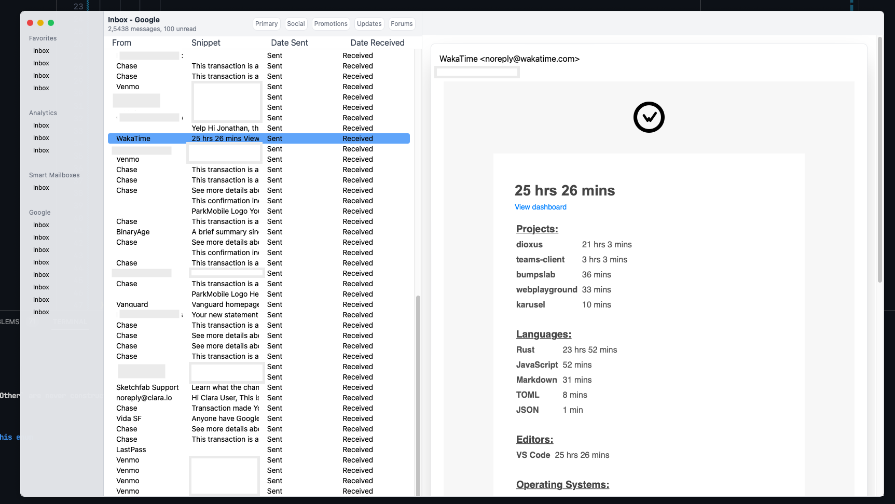

# Blazemail

A full-featued, beautiful, mail client that doesn't suck.

Works on mac, windows, linux, mobile, web, etc.

## Features, status

Blazemail is currently very much in an work in progress state.

Currently it only supports gmail, and doesn't have a complete sync system.

The goals of blazemail are to:

- have multithreaded email downloading, indexing
- manage multiple accounts very well
- support mobile, web, desktop
- include some AI-assisted writing
- include plots, charts, and other advanced inbox management solutions

Blazemail will focus on being
- blazingly fast
- secure
- full featured
- stability
- make you actually happy to check your email

With blazemail I'm looking to bring back some of Google's old inbox product with open source.

Eventually there will be some paid component, probably to take advantage of cloud-powered features like:
- Self-hosting
- Send-later, link tracking
- AI integration?

